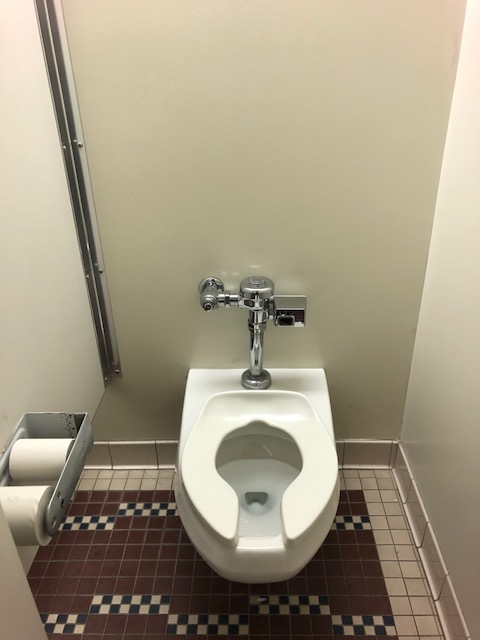
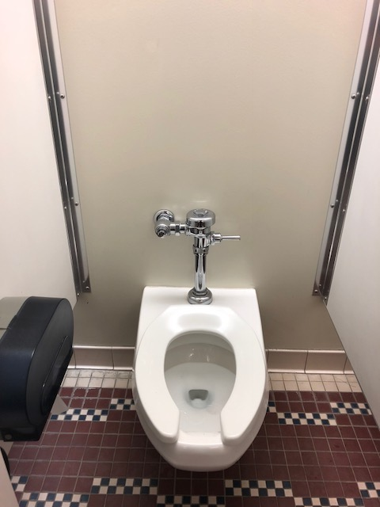

When using the bathroom there are very few things that are of immediate concern to the user. Two of things that come to mind are cleanliness and efficiency. The user is going to use a bathroom presummably whether or not the toilet is automatic, the realization of which type of toilet they are using usually comes later. The urgency of using the bathroom is most importat, once complete they simply want to get out of there.

Below is an automatic toilet.

Here the user may flush without having to touch a potentially germ ridden surface. The design incorporates a signifier by actually not including the traditional signifier. Below we see the toilet we are all used to and recognize the silver bar on the right to be how we would normally flush the toilet. The lack of the standard bar signifier tells the user they need not flush manually. 

 

Additionally, as Norman notes, the immediate feedback given by the automatic toilet lets the user know without doubt that they don't need to flush. It already flushed itself once the user is done!
Individuals using the toilet are looking for effeciency and cleaniness and I propose that the automatic toilet acheives these goals. 

