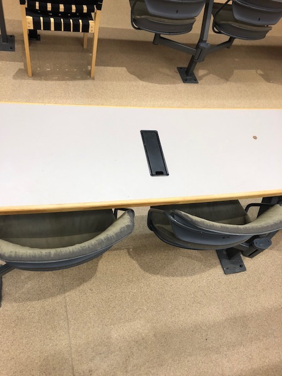
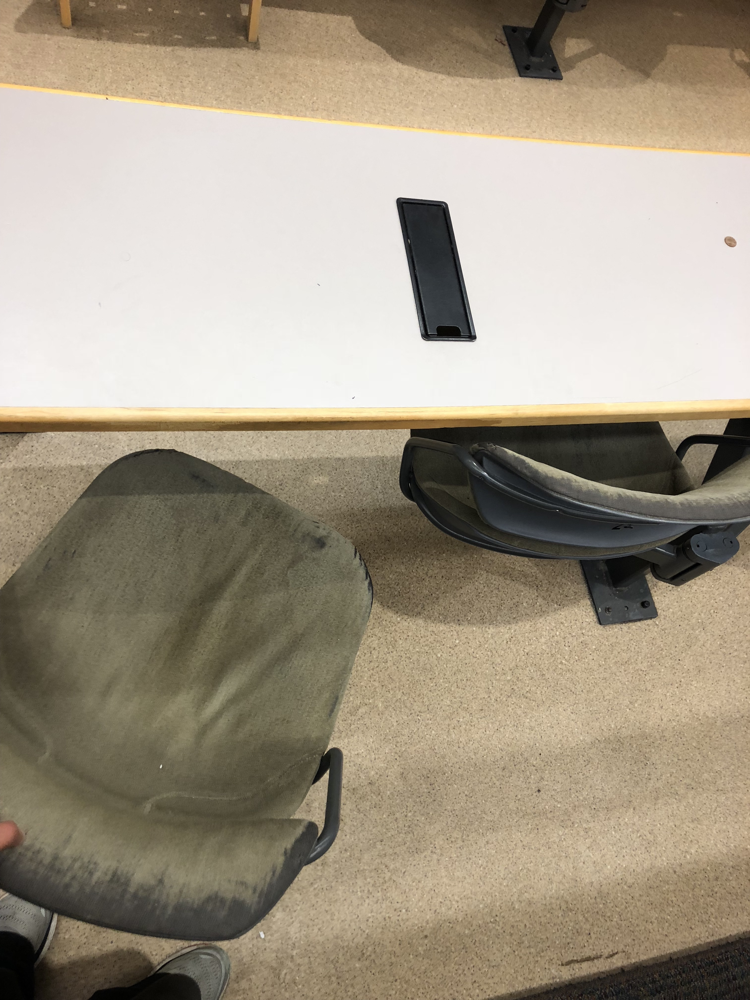
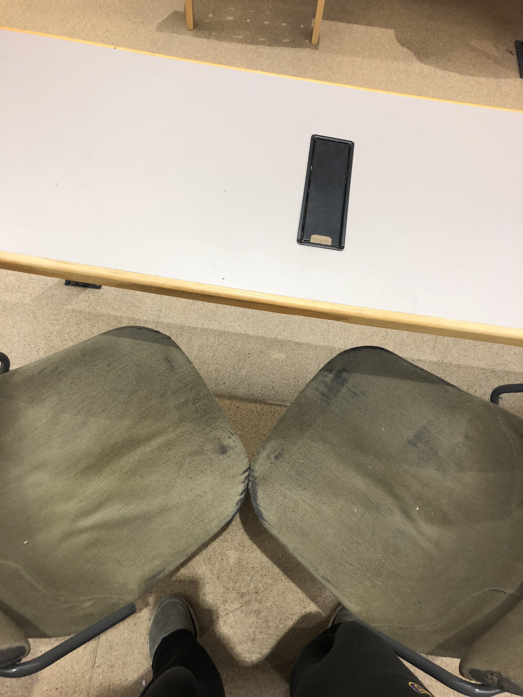

These are the chairs found in Wege auditorium at Williams College. This space is meant for larger lectures and is used for events as well. This space is meant to hold many people, therefore all the seats are expected to be filled.

I recall my first time trying to pull one of these chairs out. I didn't understand the swiveling nature of them and pulled the chair in the wrong direction, giving me a "Norman Door" experience due to the lack of signifier. Once you get past that though the chairs seem very efficient, many chairs in a small space without the clutter and noise of traditional chairs. Below we can see how the chair pivots to allow the user to sit down.

The point of a chair is to have a comfortable and accesisble place to sit. These chairs are extremely noisy due to the pivoting mechanism and they are not particularly comfortable. If you can get past that then you run into the problem where both you and your neighbor go to leave at the same time. Now since every other pair of chairs swivels toward the same point, you knock knees with your neighbor. As seen below the chairs get sort of awkwardly wedged together. 

These chairs are interesting to look at and use but when it comes to comfort and the ability to get out of your seat without disrupting your neighbor they are quite bad. I would argue that the desk and chair arrangement in Wege is not worth the sophistication, regular desks and chairs are superior. Having a chair fixed to a pivot like this only reduces clutter which is not something that the user is immediately concerned with. 
