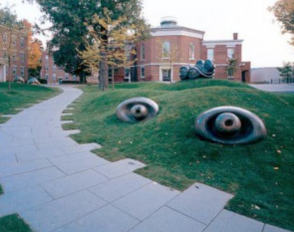
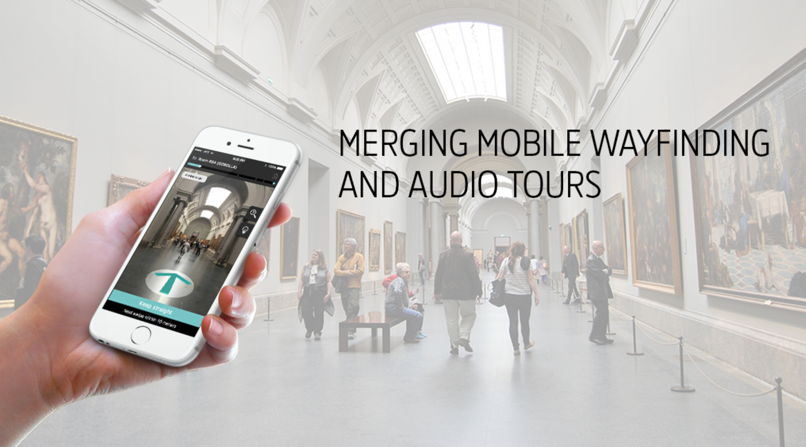

*the museum of interest. Image from art.williams.edu*

## A Problem

  One design problem of the museum experience is that navigating a museum may be challenging for a visitor who is not already familar with the museum. An individual may enter the museum and start in one gallery and feel unsure of which way they should move through the space to align with their interests or questions. Since WCMA in particular does not have an overwhelming amount of foot traffic, it can be unclear which direction through the space is recommended or if there are any spaces that are meant to be viewed in conjunction with others. As a curator, how the visitors travel through the space may be of great importance for seeing if the layout of the exhibitions is having the intended effect or if it has created an unexpected pattern of movement.  
  
  
## A Solution
  The solution could be approached by having an opt-in small device that the visitors carry with them when they enter the musuem. The device would be a small necklace that could also function as a sticker or bracelet that other museums use to recognize patrons paid for admission. 
  
  The necklace would track the location of the individual through the museum and also record time to see how long the visitor stayed in certain areas. A website could have a real time look at the patrons currently in the museum as well as a way of accessing foot traffic records from previous days or hours. The tracking could increase security and safety in addition to knowledge about the habits of visitors. 
  
  It is crucial to incorporate the visitors into the website so that they feel less like their privacy is violated and more like the have benefitted the experience. One possibility could be a sign in using the serial number of the ncklace and the hours that you were in the museum to allow the visitor to see their path trhough the museum and have the opportunity to click on icons for the pieces of art that will display the digitized version of the pieces. In this way the visitor may relive and recall the experiences. 
  
  
  
  ### Broad Goals
  
  
  *one proposed way of wayfinding by Eyedog Indoor Navigation. Image from www.eyedog.mobi*
  
  The device would not have a screen or any digital qualities to distract the user from the art and in gallery experiences. This proposal addresses ways of enhancing wayfinding in the museum and aims to quantify the intimate experience in the museum by tracking the time spent standing in the same place. 
  
  
 
