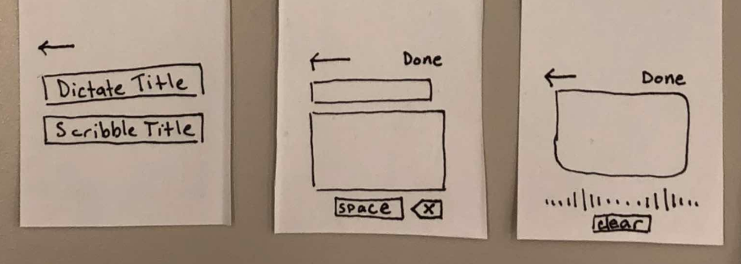
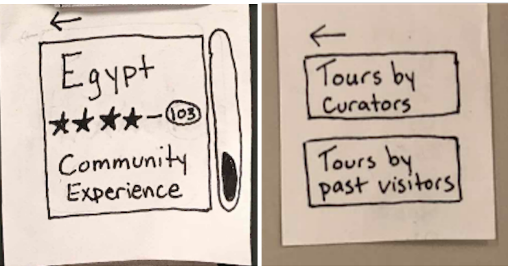
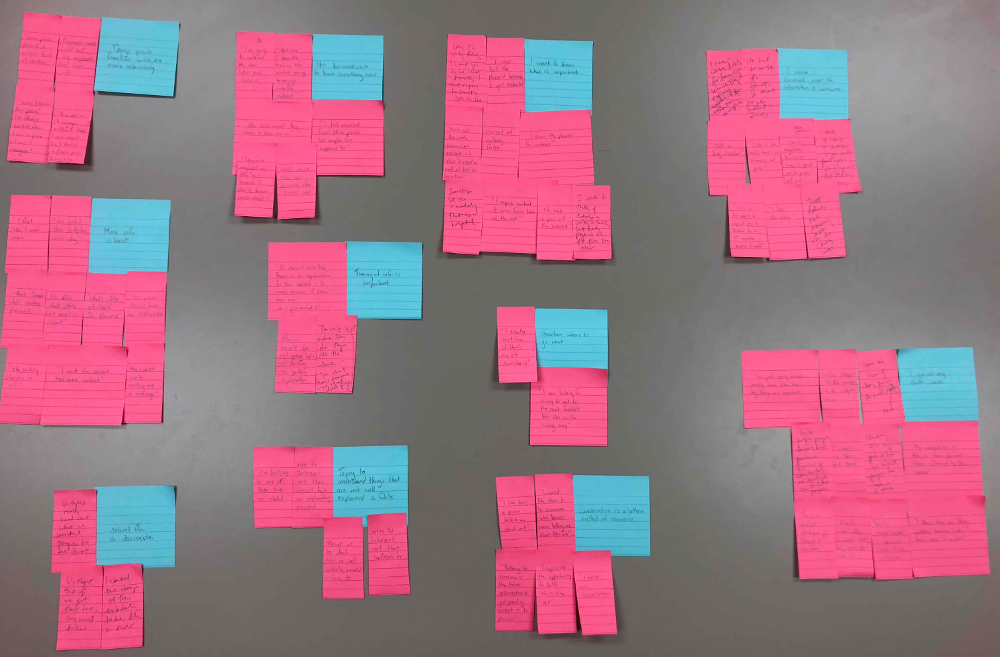
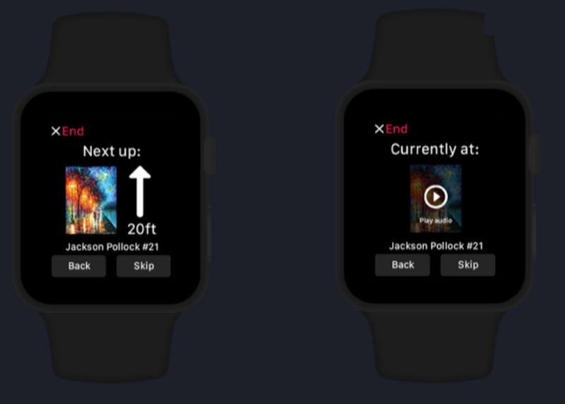

## Overview:
 
Coming into Human Computer Interaction, or HCI, I had no idea what to expect. Despite being a computer science major in my senior year, I had no experience with design or research. As the semester went on I was pleasantly surprised to find a crossover between one of my favorite subjects, sociology, and computer science. I have enjoyed the ways the HCI has taken our learning away from implementation and pushed me to consider the reasons why I should or should not build something. The user design and research processes taught me about the importance of repetition and other crucial concepts that I will go into more in this post. However, one of the most interesting topics we discussed this semester was ethics. One of my favorite things that Iris said at the conclusion of this section was a quote from Jurassic Park: “Your scientists were so preoccupied with whether or not they could, they didn’t stop to think if they should”. These are glimpses into the many things I learned throughout this semester that I am excited to bring to my future adventures in problem solving.

### Improving accessibility benefits everyone:

One of the main things that I learned in the accessibility section of the course was in the reading “Design With Accessibility in Mind: The POUR Methodology”. One of the most insightful points of this article was the “Curb-Cut-Effect” which is the idea that by improving accessibility for one group of people, you actually increase accessibility for everyone. In the case of a curb cut out, accessibility for handicapped individuals is clearly increased but as a byproduct runners, individuals with strollers, and elderly people are also benefitting from the same change. Late in the semester I received an invitation for a survey from a psychology class. The survey was asking questions about the handicap accessibility of the Williams College campus and asked if I thought improvements would benefit the campus or would only benefit those that have a physical handicap. Knowing what I know now I found this question funny because the research has already been done. Any accessibility improvement only strengthens a design, it does not detract from it. In our design project, I remember previously being hesitant for providing several options for inputting a tour title. At the time I felt that it was simpler to just have one way to input and too many options wouod give a cluttered look. However, after this section I realized that providing many options for input not only benefited people with differences of ability, but also supported a range of scenarios. Below are the screens that were updated from to create the accessibility version of this feature. 

 [Design With Accessibility in Mind: The POUR Methodology](https://theblog.adobe.com/design-with-accessibility-in-mind-the-pour-methodology/)

### Ethics is everywhere:

Engineers, designers, and managers are all to blame if and when a computer makes an unethical choice. Every individual in a company has the ability to make a choice whether or not to support an unethical design or product, no matter how small their role. In class when we used the MIT quiz, Moral Machine, to determine if we built a self driving car what kinds of decisions it would make, I was struck by the reality of that situation. It was all fun and games at first but when you realize that a car actually must make the decision of who to kill in a certain situation. Is it always life or death? Unlikely, but even menial tasks can have huge impacts on the performance and decision making of algorithms. Not every software engineer will be working on self driving cars and other potentially dangerous technology, however more technology than we think could have biases. In my sociology class, "The Panopticon: Surveillance, Power, and Inequality” we have discussed the implications of technologies such as “PredPol” which is a predictive policing software. As many discussions have alluded to in that class, we build technology that is meant to bring justice. However, if we’ve done nothing to change the framework in which these technologies are built thenology will rely on the same biases that have led to a corrupt system. It scares me to consider that we might be so focused on the seduction of technology that we do not take the time to question if the technology is actually going to improve the current situation, or rather perpetuate major issues such as racial intolerance. 

[MIT Self Driving Car Quiz](http://moralmachine.mit.edu/)

[Baltimore Sun Article about PredPol](https://www.baltimoresun.com/news/maryland/crime/bs-md-ci-sean-malinowski-20180123-story.html)

### The user is not like me:

The user is not like me. Although this principle is succinct it was very hard to learn because the urge is always to make something that will help you. At each turn in the  design process, from the proposal to the video prototype I was constantly catching myself making suggestions because I thought that they would be features and improvements that I would like. My mistake was that the suggestions were not evidence based. That is what is at the crux of “the user is not like me”, evidence! Every change and improvement to our design was motivated by users, whether in a contextual inquiry or in a walkthrough. For example a common pitfall is using language that made sense to me as a developer, but is not the way that the user thinks about the situation. When engaged in a usability test with a participant, she was confused about what is meant in the screen below by “community experience”. She said that she didn’t understand how that was different from the other tour offered. We had used the words “community experience” over and over in our discussion of how to connect to the unique williams community. Clearly we did not communicate this effectively in our design in chose the solution shown below by allowing the user to choose between two possible sets of tours, one by curators and the other by community members.

### Trust the process:

Something I was unsure about from the beginning was that the project at the end of the semester would not be something that I felt I recognized as my own. I was unsure about being in a group with people who all had their own unique project proposals and how would could possibly come to agree on something that reflected ideas from each contributor. What I didn’t realize at the time was how much even our initial group project proposal would transform and grow. At each stage of the process, from the affinity diagram to the heuristic evaluation we were pushed to re-evaluate the design and respond to the needs of the users, rather than aiming to adhere to our proposal. We retained main ideas, but never let our personal desires hold us back from developing the design. In the affinity diagram shown below, the blue sticky notes repsented the headers that summarized the pink sticky notes. The pin sticky notes were quotes from contextual inquiries, therefore the headers also had to be fro a user perspective. This is just an example of one of the ways that the process guided us in the right direction. I realized that the process was more about the dynamic learning and that as long as we got to the end having implemented the techniques we read about, we would create a design that we could all be proud of. Part of trusting the process also became trusting my groupmates. I was lucky to have hard working groupmates that were supportive and talented each in their own ways. This allowed for amazing opportunity for teaching eachother the skills we were good at and having a harmonious group project experience. 

### Creativity where it counts

When it came to designing the features of our app, we had to recognize that there were some aspects that we wanted to approach and an entirely new way. These were our tasks. Then there were other things that in and of themselves were tasks, but had already been optimized and therefore we didn't need to spend our energy on them. For example, in our design we chose to use the font that is used on the Apple watch because upon reading their design documentation, it was clear that Apple had researched which font was the most visible on the small screen. Thus our group was able to spend more time on the completion of our main tasks such as the navigation intersected with the option of additional information. Because of the iterative nature of the design we got to try a couple different screen layouts for the navigation and the audio option buttons. After input from users we settled on this really sleek design that incorporates a lot of brainstorming despite having a simplistic feel seen below. The basic idea here is that as a designer I should not be reinventing the wheel. This also connects back to ideas from our very first readinging assignment about Norman doors. Designers often get caught up in trying to redesign something that is already functioning efficiently and is easily recognizable by users. When designers make this mistake withut taking time to offer the correct affordances and signifiers then their designs are hard to understand and use. Innovative design is of course an important goal to have, but the innovation needs to be coupled with appropriate research so that that we can trust that users will be able to learn to interact with the new design.

Donald A. Norman. 2002. The Design of Everyday Things. Basic Books, Inc., New York, NY, USA.

### Conclusion

This project challenged me in many ways for example learning to perform an effective contextual inquiry and learning how to use tools such as InVision for digital prototyping. Yet, this project is one of the most rewarding assignments I have completed. I am confident that the lessons I have outlined here have far reaching implications in any field of work. Additionally, the skills that I have developed as a team member and as a creative evidence based thinker will be advantageous in any position I may end up in after college. 
